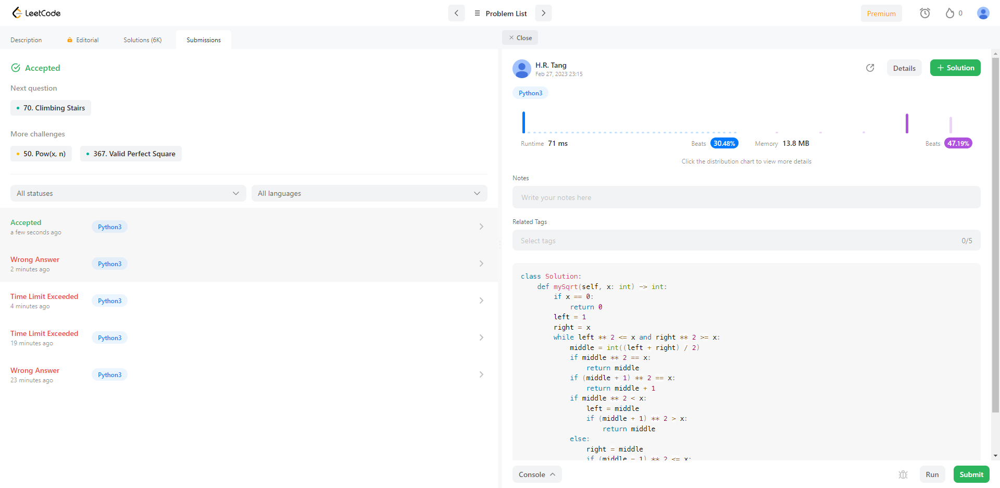

## AIgo_Homework_01

唐浩然 

2201111746


#### LeetCode 1


**code：**

```python
class Solution:
    def twoSum(self, nums: List[int], target: int) -> List[int]:
        hash_map = dict()
        for i, num in enumerate(nums):
            re = target - num
            if re not in hash_map.keys():
                hash_map[num] = i
            else:
                return [hash_map[re], i]
```

**算法思路：**

使用字典对于已经查找过的数字值与id建立连接，在后续搜索中可以利用剩余值直接对数组中是否存在该数字进行查找，并直接返回该元素索引值；

#### LeetCode 69



code:

```python
class Solution:
    def mySqrt(self, x: int) -> int:
        if x == 0:
            return 0
        left = 1
        right = x
        while left ** 2 <= x and right ** 2 >= x:
            middle = int((left + right) / 2)
            if middle ** 2 == x:
                return middle
            if (middle + 1) ** 2 == x:
                return middle + 1
            if middle ** 2 < x:
                left = middle
                if (middle + 1) ** 2 > x:
                    return middle
            else: 
                right = middle
                if (middle - 1) ** 2 <= x:
                    return middle - 1 
```

**算法思路：**

利用二分查找法找到符合条件的整数值；

#### LeetCode 70


```python
class Solution:
    def climbStairs(self, n: int) -> int:
        return int((((1+sqrt(5))/2)**(n+1) - ((1-sqrt(5))/2)**(n+1))/(sqrt(5)))
```

**算法思路：**

直接带入斐波那契序列的通项公式，最后对于结果取整输出；

!.png)

code:

```python
class Solution:
    def climbStairs(self, n: int) -> int:
        a = 0
        b = 1
        for i in range(n):
            a, b = b, a + b
        return b
```

**算法思路：**

利用斐波那契序列的推导规律完成本题结果给出，第n个数字则需要进行n次迭代
