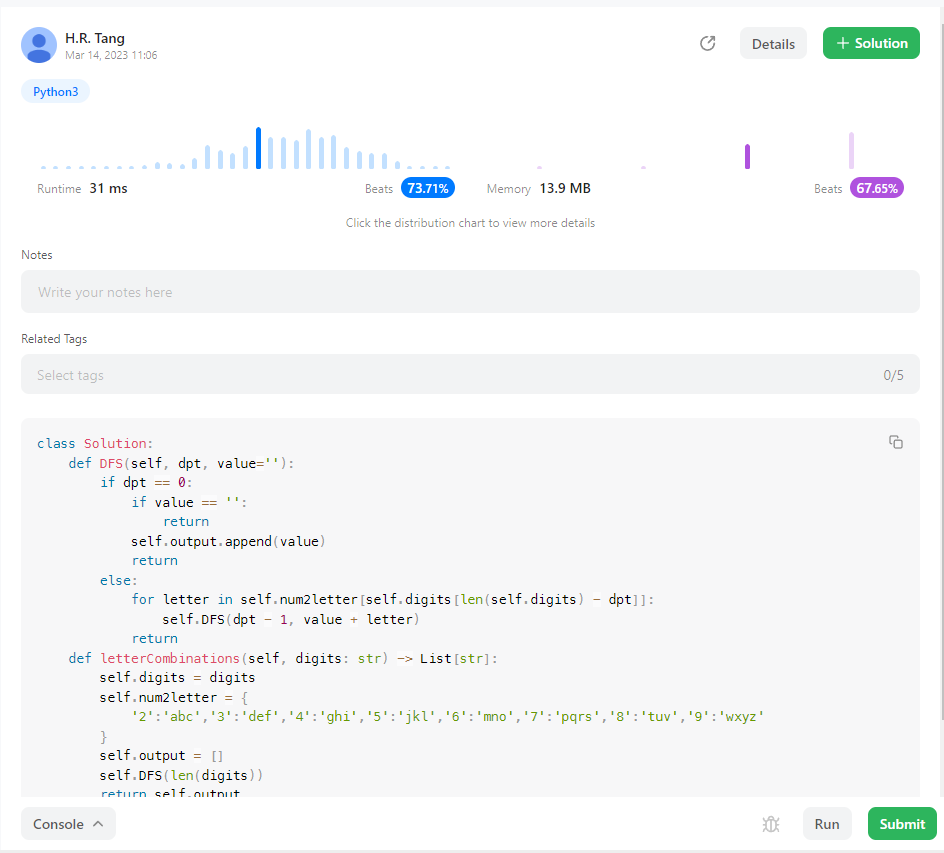

## AIgo_Homework_03

唐浩然 

2201111746


#### LeetCode 16


**code：**

```python
class Solution:
    def threeSumClosest(self, nums: List[int], target: int) -> int:
        nums.sort()
        closest_num = 0
        distance = 1e9
        for i, num in enumerate(nums):
            j = i + 1 
            k = len(nums) - 1
            while j < k :
                sum_3 = num + nums[j] + nums[k]
                distance_tmp = abs(target - sum_3)
                if distance_tmp < distance:
                    distance = distance_tmp
                    closest_num = sum_3
                if target - sum_3 >= 0:
                    j = j + 1
                else:
                    k = k - 1
        return closest_num 
```

**算法思路：**

正常利用For循环对于数组中任意三个数字进行搜索需要的复杂度是O^(n3)的，在本题中利用sort预先对数组进行排序，之后利用数组的有序性，对每一个位置后面未搜索的部分利用头尾两个指针进行遍历：

加和小于target则头指针向后移动；

加和大于target则尾指针向前移动；

这样时间复杂度为O^(n2) + O^(nlogn) = O^(n2)

#### LeetCode 17



**code:**

```python
class Solution:
    def DFS(self, dpt, value=''):
        if dpt == 0:
            if value == '':
                return
            self.output.append(value)
            return
        else:
            for letter in self.num2letter[self.digits[len(self.digits) - dpt]]:
                self.DFS(dpt - 1, value + letter)
            return
    def letterCombinations(self, digits: str) -> List[str]:
        self.digits = digits
        self.num2letter = {
        '2':'abc','3':'def','4':'ghi','5':'jkl','6':'mno','7':'pqrs','8':'tuv','9':'wxyz'
        }
        self.output = []
        self.DFS(len(digits))
        return self.output
```

**算法思路：**

本题需要遍历所有数字包含的所有字母组合，而直接For循环无法判断层数，因此采用递归搜索的方式，DFS（）函数按照目前所处的深度（即当前数字位置进行搜索），每搜索一层需要枚举出当前所表示字母组合加上后续可能产生的字母组合进行压栈，并进入下一层，其中dpt表示当前数字所在位置，一旦发现dpt=0即搜索到了最后一层，则将产生的字母组合取出放入输出中，且函数返回（相当于函数弹出运行栈）继续处理上一层函数；每一层函数中For循环遍历结束也会进行返回操作；

#### LeetCode 19


**code:**

```python
# Definition for singly-linked list.
# class ListNode:
#     def __init__(self, val=0, next=None):
#         self.val = val
#         self.next = next
class Solution:
    def removeNthFromEnd(self, head: Optional[ListNode], n: int) -> Optional[ListNode]:
        cnt = 1
        head_p = head
        while head_p.next != None:
            head_p = head_p.next
            cnt += 1
        del_num = cnt - n
        if del_num == 0:
            return head.next
        head_p = head
        del_num = del_num - 1
        while del_num:
            head_p = head_p.next
            del_num = del_num - 1
        head_p.next = head_p.next.next
        return head
```

**算法思路：**

首先迭代ListNode得到输入链表的总长度，接下来利用长度cnt-n+1即可得到删除节点在链表中所处的位置，之后只要将其上一个节点的next指针指到其下一个节点即可完成删除；
