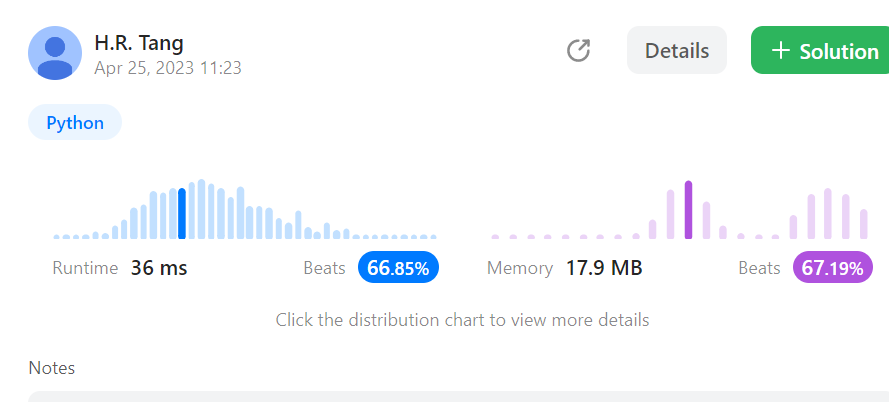
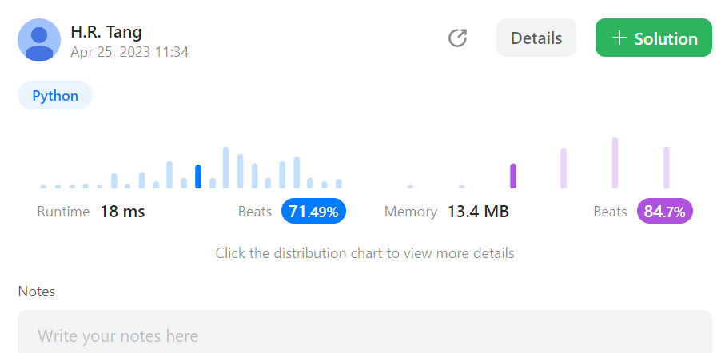

## AIgo_Homework_08

唐浩然 

2201111746


#### LeetCode 235


**code：**

```python
# Definition for a binary tree node.
# class TreeNode(object):
#     def __init__(self, x):
#         self.val = x
#         self.left = None
#         self.right = None

class Solution(object):
    def print_ancestor(self, root, p, ancestor, flag = 0):
        ancestor.append(root)
        if p.val == root.val:
            flag = 1
            return ancestor, flag
        elif root.left != None:
            ancestor, flag = self.print_ancestor(root.left, p, ancestor, flag)
            if flag:
                return ancestor, flag
            ancestor.pop()
        if root.right != None:
            ancestor, flag = self.print_ancestor(root.right, p, ancestor, flag)
            if flag:
                return ancestor, flag
            ancestor.pop()
        return ancestor, flag

        

    def lowestCommonAncestor(self, root, p, q):
        """
        :type root: TreeNode
        :type p: TreeNode
        :type q: TreeNode
        :rtype: TreeNode
        """
        ancestor_p, _ = self.print_ancestor(root, p, [], 0)
        ancestor_q, _ = self.print_ancestor(root, q, [], 0)
        i = 0
        while i < len(ancestor_p) and i < len(ancestor_q) and ancestor_p[i] == ancestor_q[i]:
            i += 1
        return ancestor_p[i-1]
        
```

**算法思路：**

利用深度优先搜索，找到两个节点的祖先路径，之后遍历祖先路径，找到最近的共同祖先节点；

#### LeetCode 110



**code:**

```python
# Definition for a binary tree node.
# class TreeNode(object):
#     def __init__(self, val=0, left=None, right=None):
#         self.val = val
#         self.left = left
#         self.right = right
class Solution(object):
    def is_height_balanced(self, root):
        if root == None:
            return 0, True
        if root.left == None:
            height_l = 0
            flag_l = True
        else:
            height_l, flag_l = self.is_height_balanced(root.left)
        if root.right == None:
            height_r = 0
            flag_r = True
        else:
            height_r, flag_r = self.is_height_balanced(root.right)
        flag = abs(height_l - height_r) <= 1
        return max(height_l, height_r) + 1, flag_l & flag_r & flag

    def isBalanced(self, root):
        """
        :type root: TreeNode
        :rtype: bool
        """
        height, flag = self.is_height_balanced(root)
        return flag
```

**算法思路：**

递归判断每个子节点是否是height_balanced, 根据左右儿子节点的高度以及是否分别height_balanced判断当前节点是否balanced.

#### LeetCode 257



**code:**

```python
# Definition for a binary tree node.
# class TreeNode(object):
#     def __init__(self, val=0, left=None, right=None):
#         self.val = val
#         self.left = left
#         self.right = right
class Solution(object):
    def __init__(self):
        self.path_list = []
    def DFS(self, root, path):
        if path == '':
            path = str(root.val)
        else:
            path = path + '->' + str(root.val)
        if root.left == None and root.right == None:
            self.path_list.append(path)
            return 
        if root.left != None:
            self.DFS(root.left, path)
        if root.right != None:
            self.DFS(root.right, path)
        return

    def binaryTreePaths(self, root):
        """
        :type root: TreeNode
        :rtype: List[str]
        """
        self.DFS(root, '')
        return self.path_list
```

**算法思路：**

对于给定的树做DFS，同时额外开一个全局变量列表用于存储路径，只有当节点左右儿子都是None时存入路径，其余均为遍历并添加节点到当前路径；
